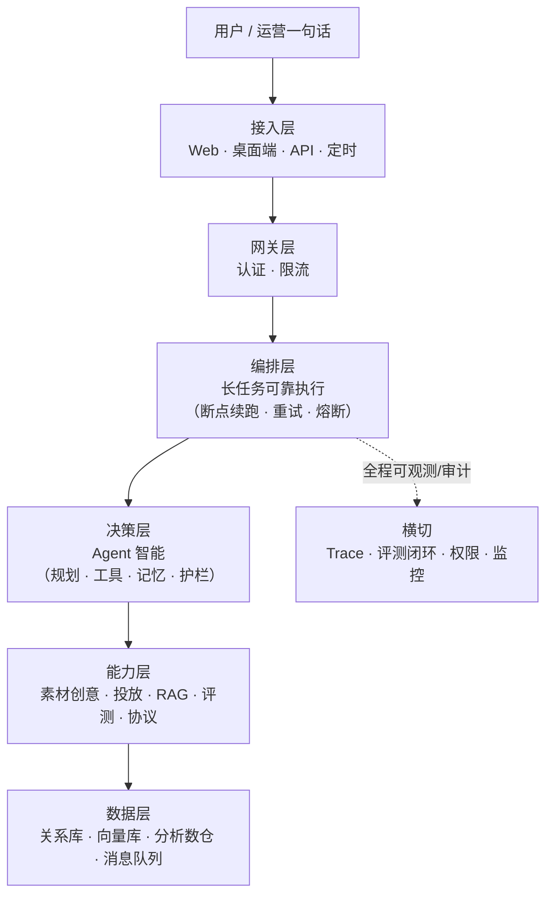

# 长任务 Agent 平台 · 产品方案

> 一份面向业务/管理者的产品方案——重点讲清"这是什么、解决什么问题、价值在哪、能否落地"。可直接导出 PDF 用于对外沟通。

---

## 一、产品定位

**一句话**：一个能**无人值守、可靠执行长周期 AI 任务**的自动化平台，深耕**程序化广告行业**——素材、落地页、投放、竞价、策略、验证全链路自动化。

**形态**：自然语言进、交付物出。用户说一句"帮我把上季度投放数据整理成周报发飞书"，平台自动规划、执行、质检、交付——全程无人值守，几十小时的任务也不丢、能续、可审计。

---

## 二、解决什么问题

### 行业痛点
- 广告行业有大量**重复性长任务**：批量素材生成、批量落地页、投放数据回填、策略调控、AB 效果验证——一次跑几小时到几天
- 现有 AI 应用大多是**单次对话**，跑不了多步骤长任务，进程一崩全部丢失
- 通用 AI 平台（如 Coze/Dify）能搭标准应用，但**解决不了广告行业的深度业务定制**

### 我们做什么
把"长任务可靠执行 + 广告业务深度自动化"结合起来，做成**自己的执行底座**——既能可靠跑完几十小时的任务，又真正懂广告投放的业务闭环。

---

## 三、产品价值

| 价值 | 说明 |
|---|---|
| **长任务可靠交付** | 断点续跑、自动重试、预算熔断——几十小时任务不丢、能续、可审计 |
| **广告全链路自动化** | 素材 → 落地页 → 投放 → 竞价 → 策略 → 验证，一条龙 |
| **质量可控** | 产出自动过质量门禁 + 效果评测闭环，不达标自动打回重跑 |
| **可嵌入现有体系** | 能嵌入 CI/研发平台，工具与 Agent 组件化可复用 |
| **数据私有化** | 投放/策略数据本地私有部署，不出域 |

---

## 四、核心能力

| 能力 | 说明 |
|---|---|
| **任务编排与可靠执行** | 长流程编排（Temporal），断点续跑/重试/心跳/熔断 |
| **企业知识检索** | 企业文档 RAG + 代码库 RAG 双路，问答带溯源 |
| **素材与创意生成** | 图片生成 + 文案生成 + 动态创意（DCO 按实时信号组材）+ 合规检查 |
| **素材巡检与治理** | 批量巡检投放中素材（在投/下架/违规/缺图/被拒），异常自动告警 + 补投 |
| **素材生命周期管理** | 上传 → 审核 → 上下架 → 版本管理 → 淘汰，全生命周期自动化 |
| **落地页巡检** | 批量检查落地页可用性（打不开/404/跳转异常/加载慢），自动修复或告警 |
| **合规检查** | 广告法合规、特殊行业资质、敏感词/违禁内容扫描，投放前自动过检 |
| **数据监控与告警** | 转化率/预算/投放异常监控，自动告警 + 自动处置（降级/暂停） |
| **投放报表分析** | 自动生成投放报表（eCPM/ROI/消耗），归因分析，定期推送 |
| **媒体渠道对接（Adapter）** | 统一对接各媒体渠道（ADX/信息流/开屏），建单/调价/报表一站式管理 |
| **广告投放自动化** | 一句话起投、自动对接媒体上下游、调价/停量、**实时防超预算** |
| **广告协议与渲染** | OpenRTB 竞价、MRAID/VAST 广告协议解析、落地页渲染 |
| **竞品分析** | 自动抓取并分析竞品素材/创意/投放策略，输出洞察报告 |
| **反作弊** | 点击/转化异常检测（频次/设备/IP），屏蔽虚假流量，保护预算 |
| **效果验证** | AB 实验算 lift、黄金集回归防退化、E2E 对抗压测 |
| **质量评测闭环** | 评测四层（语法/契约/黄金集确定性前置 + LLM 抽检）+ 失败回流迭代 |

---

## 五、技术架构（概览）

**一张图看懂**：



**分层说明**：

```
① 接入层    Web 工作台 / 桌面端 / 开放 API / 定时任务
② 网关层    认证 + 限流 / 鉴权 / 路由
③ 编排层    长任务工作流（断点续跑 / 重试 / 心跳 / 预算熔断）
④ 决策层    Agent 决策（路由 / 规划 / 执行 / 工具 / 记忆 / 护栏）
⑤ 模型网关  多模型路由 / 降级 / 限流 / 成本
⑥ 能力层    双路 RAG / 素材创意 / 投放 / 沙箱 / 评测 / 协议
⑦ 数据层    关系库 + 向量库 + 内存库 + 分析数仓 + 消息队列
横切        可观测（全链路 Trace）/ 评测闭环 / 权限审计 / 监控告警
```

技术选型：主语言 TypeScript/Node + Go（投放引擎/高并发）+ Rust（沙箱运行时）+ Python（多模态/实时聚合），前端 Vue3（可扩展桌面端）。

---

## 六、落地成果（已实现，可验证）

| 模块 | 已实现资产 |
|---|---|
| Agent 平台 | matrix Agent 平台（编排/决策/评测） |
| 广告投放引擎 | ad-tech-labs（Go + Python）：起投 / 竞价 / 策略 / AB / 实时聚合 |
| 落地页低代码 | landing-page-builder（页面生成 + SDK 渲染） |
| 广告协议 | ad-protocol-engine（MRAID / VAST，Rust/WASM） |
| 质量验证 | 红队对抗压测（Playwright 真机） |
| 前端平台 | web_youngs（广告业务前端） |

**量化成果**：60+ 规格文档、评测四层、RAG 检索命中 100%、策略回归防退化（pass_rate 1.0）、AB 实验 lift +15%、预算熔断实时生效。

---

## 七、演进规划

```
V1  长任务平台（可靠交付 + 可观测）——已完成架构设计
V2  桌面端（本地驻留 + 本地沙箱）——规划中
V3  企业级（多租户 / 安全合规 / 离线分发）——远期
```

---

## 八、结语

> 我们不只做一个"能对话的 AI"，而是做一个**能在程序化广告行业可靠落地、跑得完、跑得对、还能证明它跑得对**的自动化平台——把重复的长任务交给平台，让人专注决策。
